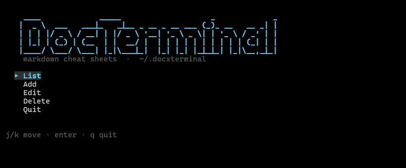

# DocxTerminal

Cheat sheet Markdown berbasis terminal dengan antarmuka TUI dan CLI. Menyimpan dokumen sebagai file `.md` individual untuk kemudahan pengelolaan dan versi kontrol.



## Fitur Utama

- **Dual Mode**: Antarmuka TUI interaktif (`dt`) dan perintah CLI cepat.
- **File-Based Storage**: Setiap dokumen disimpan sebagai file `.md` terpisah di `~/.docxterminal/`.
- **Editor Fleksibel**: Mendukung `$EDITOR`, `$VISUAL`, `vim`, `nano`, atau `notepad` (Windows).
- **Rendering Indah**: Render Markdown otomatis dengan Glamour (mendukung tema terang/gelap dan wrapping responsif).
- **Seed Template**: Tersedia template awal untuk `git`, `npm`, `pnpm`, dan `yarn`.
- **Keamanan**: Validasi nama file untuk mencegah path traversal.

## Instalasi

Prasyarat: [Go](https://go.dev/dl/) versi 1.24 atau lebih baru.

### Opsi 1: Script Installer (Disarankan)

**Linux / macOS / Git Bash (Windows)**
```bash
git clone https://github.com/satriazoid/DocxTerminal.git
cd DocxTerminal
bash install.sh
```

**Windows CMD**
```cmd
git clone https://github.com/satriazoid/DocxTerminal.git
cd DocxTerminal
install.bat
```

**Windows PowerShell**
```powershell
git clone https://github.com/satriazoid/DocxTerminal.git
cd DocxTerminal
powershell -ExecutionPolicy Bypass -File install.ps1
```

### Opsi 2: Instalasi Manual

Jika script installer tidak berfungsi, Anda dapat membangun biner secara manual:

```bash
git clone https://github.com/satriazoid/DocxTerminal.git
cd DocxTerminal
go build -o dt .

# Pindahkan ke folder PATH sistem Anda
# Linux/macOS: cp dt ~/.local/bin/
# Windows: Salin dt.exe ke %USERPROFILE%\go\bin atau folder PATH lainnya
```

### Verifikasi

Restart terminal Anda, lalu jalankan:
```bash
dt --version
dt list
```

## Penggunaan

### Mode TUI (Interaktif)

Jalankan perintah berikut untuk membuka menu utama:
```bash
dt
```

**Navigasi Keyboard:**

| Tombol | Aksi |
| :--- | :--- |
| `j` / `k` atau `↓` / `↑` | Navigasi daftar |
| `Enter` | Pilih dokumen / Konfirmasi |
| `e` | Edit dokumen (saat mode lihat) |
| `y` / `n` | Konfirmasi hapus |
| `q` / `Esc` | Kembali / Keluar |
| `Ctrl+C` | Paksa keluar |

**Menu Utama:**
- **List**: Melihat daftar dokumen. Tekan `Enter` untuk membaca (rendered), `e` untuk mengedit.
- **Add**: Membuat dokumen baru. Masukkan nama, lalu editor akan terbuka otomatis.
- **Edit**: Memilih dokumen yang ada untuk diedit.
- **Delete**: Menghapus dokumen dengan konfirmasi.
- **Quit**: Keluar dari aplikasi.

### Mode CLI (Perintah Langsung)

Anda juga dapat menggunakan perintah langsung tanpa membuka TUI:

```bash
dt list              # Menampilkan daftar semua dokumen
dt show git          # Menampilkan konten markdown 'git.md'
dt add docker        # Membuat 'docker.md' dan membuka editor
dt edit git          # Membuka 'git.md' di editor
dt delete docker     # Menghapus 'docker.md'
dt help              # Menampilkan bantuan perintah
```

**Alias Tersedia:** `ls`, `cat`, `rm`.

## Penyimpanan & Struktur Data

Dokumen disimpan secara lokal di direktori berikut:
- **Linux/macOS**: `~/.docxterminal/`
- **Windows**: `%USERPROFILE%\.docxterminal\`

**Contoh Struktur Folder:**
```text
~/.docxterminal/
├── git.md
├── npm.md
├── pnpm.md
└── yarn.md
```

> **Catatan:** Template seed akan otomatis dibuat saat pertama kali dijalankan jika folder kosong. Dokumen yang sudah ada tidak akan ditimpa. Anda juga dapat mengedit file `.md` secara langsung menggunakan editor eksternal; perubahan akan terbaca oleh TUI/CLI.

## Struktur Repositori

```text
DocxTerminal/
├── main.go          # Entry point & CLI commands
├── tui.go           # Logika antarmuka TUI (Bubble Tea)
├── store.go         # Operasi CRUD file
├── editor.go        # Deteksi & pembukaan editor
├── store_test.go    # Tes unit untuk storage
├── tui_test.go      # Tes unit untuk TUI
├── install.sh       # Script instalasi Unix/Git Bash
├── install.bat      # Script instalasi Windows CMD
├── install.ps1      # Script instalasi Windows PowerShell
├── seeds/           # Template dokumen awal
│   ├── git.md
│   ├── npm.md
│   ├── pnpm.md
│   └── yarn.md
├── .image/          # Aset gambar untuk README
└── README.md
```

## Pengembangan

Untuk berkontribusi atau mengembangkan proyek ini:

```bash
# Jalankan tes
go test ./...

# Bangun biner lokal
go build -o dt .

# Instal ulang ke PATH
bash install.sh
```

Atau jalankan langsung tanpa kompilasi:
```bash
go run . list
go run . add myguide
```

## Lisensi

Proyek ini dilisensikan di bawah [MIT License](LICENSE).

Copyright (c) 2026 Akujejo.
