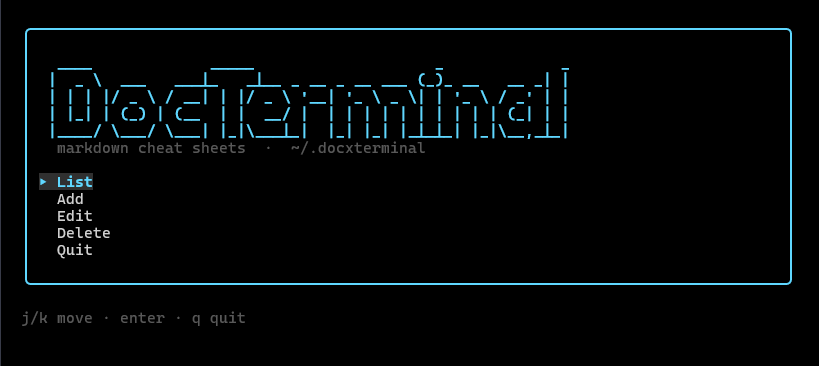

# DocxTerminal

Markdown cheat sheets di terminal. File-based CRUD. TUI + CLI.

Ketik `dt` → menu. Edit pakai `$EDITOR` / vim / nano.



Screenshot lain taruh di [`.image/`](.image/).

## Fitur

- TUI: List / Add / Edit / Delete / Quit
- CLI: `list`, `show`, `add`, `edit`, `delete`
- Storage: `~/.docxterminal/*.md` (satu file = satu dokumen)
- Seed pertama kali: `git`, `npm`, `pnpm`, `yarn`
- Editor: `$EDITOR` → `$VISUAL` → `vim` → `nano` → `notepad` (Windows)
- Nama dokumen: huruf, angka, `.` `_` `-` (path traversal ditolak)

## Install -`dt` sebagai command

Jangan double-click `dt.exe`. Install ke PATH, panggil dari terminal.

Butuh [Go](https://go.dev/dl/) 1.24+.

```bash
git clone https://github.com/satriazoid/DocxTerminal.git
cd DocxTerminal
go build -o dt.exe .
```

Salin binary ke folder yang ada di PATH. GOPATH/bin biasanya sudah:

```bash
# Git Bash / MSYS
mkdir -p "$(go env GOPATH)/bin"
cp dt.exe "$(go env GOPATH)/bin/dt.exe"
```

```powershell
# PowerShell
$bin = Join-Path (go env GOPATH) "bin"
New-Item -ItemType Directory -Force -Path $bin | Out-Null
Copy-Item .\dt.exe (Join-Path $bin "dt.exe") -Force
```

Cek PATH berisi `%USERPROFILE%\go\bin` (default GOPATH). Kalau `dt` belum ketemu:

1. Win + R → `sysdm.cpl` → Advanced → Environment Variables
2. User `Path` → New → `%USERPROFILE%\go\bin`
3. Tutup semua terminal, buka lagi

Verifikasi:

```bash
dt
dt list
```

Rebuild setelah ubah kode:

```bash
go build -o dt.exe .
cp dt.exe "$(go env GOPATH)/bin/dt.exe"
```

`go install .` menghasilkan `docxterminal.exe` (nama modul), bukan `dt`. Pakai `go build -o dt.exe` di atas.

## Usage

### TUI

```bash
dt
```

| Key | Aksi |
|-----|------|
| `j` / `k` atau `↓` / `↑` | pindah |
| `Enter` | pilih |
| `e` | edit (saat view) |
| `y` / `n` | konfirmasi delete |
| `q` / `Esc` | kembali / keluar |
| `Ctrl+C` | keluar |

Menu:

- **List** lihat dokumen, Enter = baca, `e` = buka editor
- **Add** ketik nama, Enter = buat + buka editor
- **Edit** pilih dokumen, buka editor
- **Delete** pilih, konfirmasi `y`
- **Quit**

### CLI

```bash
dt list              # daftar dokumen
dt show git          # print markdown
dt add docker        # buat + buka editor
dt edit git          # buka editor
dt delete docker     # hapus file
dt help
```

Alias: `ls`, `cat`, `rm`.

## Storage

```
~/.docxterminal/
├── git.md
├── npm.md
├── pnpm.md
└── yarn.md
```

Windows: `C:\Users\<you>\.docxterminal\`

Seed dari `seeds/` hanya ditulis kalau folder kosong. Dokumen yang sudah ada tidak ditimpa.

Edit langsung file `.md` juga valid -TUI/CLI baca ulang dari disk.

## Layout repo

```
DocxTerminal/
├── main.go          CLI
├── tui.go           menu TUI (Bubble Tea)
├── store.go         CRUD file
├── editor.go        $EDITOR / vim / nano
├── store_test.go
├── seeds/           template awal
├── .image/          screenshot README
└── README.md
```

## Develop

```bash
go test ./...
go build -o dt.exe .
```

## License
MIT License

Copyright (c) 2026 Akujejo.
